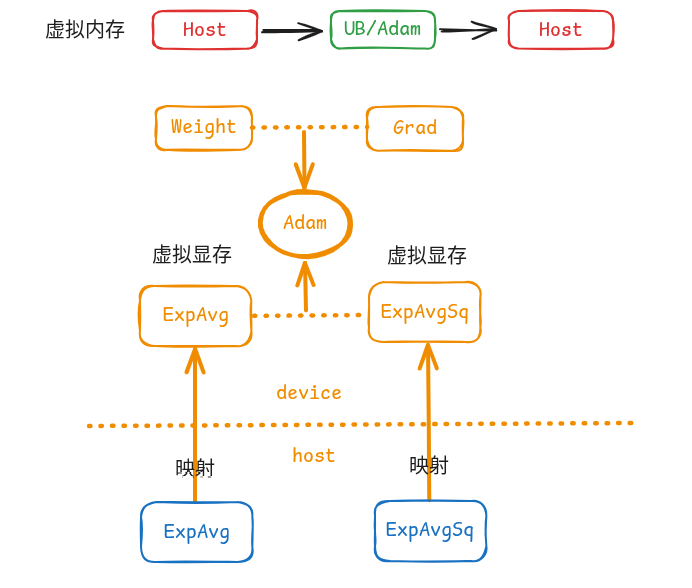

# Virtual Optimizer - 优化器显存虚拟化特性

## 背景与挑战

在大集群训练中，PP的增大会对前几个stage造成较大的显存压力；同时我们观察到，在增大梯度累积的情况下，优化器部分的一二阶动量显存swap的开销可忽略不计，因此可通过将优化器部分的显存swap到cpu上来节省整网显存，而当前分布式优化器逻辑复杂，并且与各种通信并行相互耦合，因此实现一套Swap优化器显存的系统较为复杂。


## 特性概述

Virtual Optimizer 是一套基于 Ascend NPU 虚拟内存能力的优化器显存优化方案。通过将 AdamW 优化器的一阶和二阶动量（exp_avg、exp_avg_sq）存储在 Host 内存中，而非 NPU 显存中，可以**在不修改任何训练代码的前提下，节省 NPU 显存占用**。

**核心思想**：充分利用 Ascend 驱动原生的虚拟内存映射能力，申请一个实际内存在 Host 侧但地址可被映射到 Device 上的张量，使其可参与大多数 NPU 算子计算。

<p align="center">

</p>


## 解决方案

### 核心实现原理

参考[MindSpeed框架设计的VirtualOptimizer特性](https://gitcode.com/Ascend/MindSpeed/blob/master/docs/zh/features/virtual-optimizer.md)通过修改优化器状态的分配方式，利用虚拟内存特性替代 NPU 内存分配：

#### 标准 AdamW 的做法
```python
# torch.optim.AdamW (标准实现)
state = self.state[p]
# 直接在 NPU 显存中分配
state['exp_avg'] = torch.zeros_like(p, memory_format=torch.preserve_format)
state['exp_avg_sq'] = torch.zeros_like(p, memory_format=torch.preserve_format)
```

#### Virtual Optimizer 的做法
```python
# virtual_optimizer.py (改进实现)
state = self.state[p]
# 通过虚拟内存分配，实际内存在 Host，地址映射到 Device
state['exp_avg'] = torch_npu.empty_with_swapped_memory(
    p.size(),
    device=p.device
)
state['exp_avg_sq'] = torch_npu.empty_with_swapped_memory(
    p.size(),
    device=p.device
)
```

## 配置选项

在训练任务的 TOML 配置文件（例如 `torchtitan_npu/models/deepseek_v32/train_configs/deepseek_v32_671b_debug.toml`，或实际启动训练时 `--job.config_file` 所指向的路径）中，找到对应的 `[optimizer]` 节，并添加以下配置以启用 Virtual Optimizer：

| 配置项 | 类型 | 默认值 | 说明 |
| --- | --- | --- | --- |
| `virtual_optimizer` | bool | False | 是否启用 Virtual Optimizer 特性以进行显存卸载。 |
| `virtual_optimizer_size` | float/str | 2.0 | 申请的虚拟内存空间大小，如果希望Swap掉所有的一二阶动量，可以设置为`all` |


### 配置示例
首先在配置文件中使能本代码仓的自定义配置，随后在 `[optimizer]` 节中添加以下配置，为AdamW优化器开启Virtual Optimizer特性并设置流水线切片参数：

```toml
[job]
custom_config_module = "torchtitan_npu.config.custom_config"    # 使能本代码仓的自定义配置

[optimizer]
name = "AdamW"
lr = 3e-4
weight_decay = 0.01
virtual_optimizer = true       # 启用 Virtual Optimizer
virtual_optimizer_size = 'all'  # 设置申请的虚拟内存大小
```
